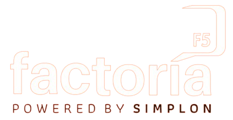
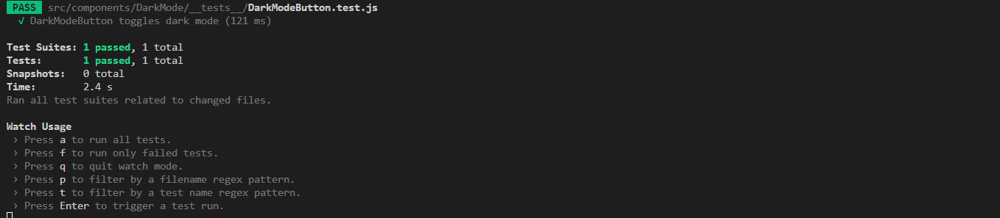
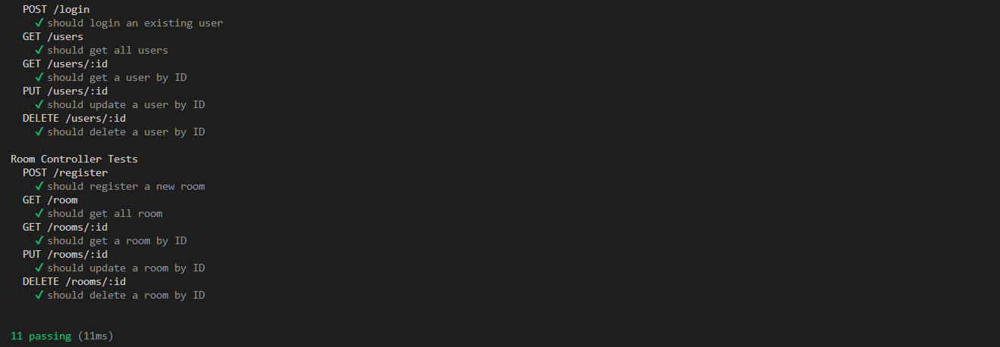

# Salas Factoria F5

Proyecto innovador de **Salas Factoria F5**, enfocado en presentar y dar a conocer las salas de las que dispone facotira F5 en su sede de Madrid y su gestión.



## Tabla de Contenidos

- [Instalación](#instalación)
- [Uso](#uso)
- [Desarrolladores](#desarrolladores)
- [Licencia](#licencia)

## Estado del Proyecto
🚧El proyecto se encuentra en estado de construcción 🚧.

## Instalación
💻

Al instalarse el proyecto en la consola se deben tener en cuenta las siguientes indicaciones: <br>
- Se debe instalar Node.js en el ordenador: ```npm install```
- Dentro de la carpeta **client** debemos escribir en la terminal:
```npm run dev```
- Dentro de la carpeta **server** debemos escribir en la terminal: ```nodemon app```
- Ambos códigos deben estar en diferentes terminales corriendo para poder ser usado el proyecto.

Para comenzar el proyecto tuvimos que instalar:
- ```npm create vite@latest```
- ```npm i -g @nestjs/cli```

Y las librerías:
- Bootstrap


## Uso

Teniendo en cuenta la anterior información se podría navegar por todas las páginas de manera libre. 

## Créditos

### Desarrolladores:
- Natalia [Linkedin](https://www.linkedin.com/in/natalia-de-bustos-garc%C3%ADa-5ba965298/)
- Mar [Linkedin](https://www.linkedin.com/in/mar-prieto-garcia/)
- Fiorella [Linkedin]()
- Eme [Linkedin]()


## Tecnologías utilizadas

 
 
 


## Metodologías Ágiles
- <a href="https://trello.com/invite/b/jGrMbiw0/ATTIda2599c0a80fcbbb44cc000337bb503fEACC54DF/pre-final-factoria"> Trello </a> </br> 
- <a href="https://www.figma.com/file/jNuSgkaU6XuysriRZE2O2l/Factoria-F5?type=design&node-id=1%3A3&mode=design&t=5hKwnMzZOVSxP6KY-1"> Figma </a> </br>
- <a href="https://github.com/MarPrieto7/salas-f5">GitHub</a> </br>

- Deploy

## Licencia

Este proyecto está bajo la Licencia [CCO](LICENSE).

Las fuentes utilizadas en este proyecto estan sujetas a licencia SIL con Copyright &copy; 2014, Indian Type Foundry (info@indiantypefoundry.com)

## Test 

Se han hecho varios test para el frontend para DarkMode, Footer, RoomCard, con resultado Passed. 



Tambien se ha realizado test para el backend para el controlador AuthController y RommController.

